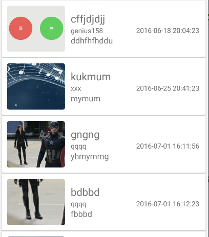

# commonfixedviewsadapter
using this util can make that a few fixed views in a root viewGroup be using like listView

## inlude lib
compile 'com.yan.fixedviewadapter:fixedviewadapter:1.0.0'

## situation 

###fixed grid

###fixed linear

###xml code like this

    <LinearLayout ...>
        <LinearLayout ...>
            <LinearLayout ...>
                <TextView
                  android:id="@+id/tv1"
                .../>
            </LinearLayout>
            <LinearLayout ...>
                <TextView 
                  android:id="@+id/tv2"
                .../>
            </LinearLayout>
        </LinearLayout>
        <LinearLayout ...>
            <LinearLayout ...>
                <TextView .../>
            </LinearLayout>
            <LinearLayout ...>
                <TextView .../>
            </LinearLayout>
        </LinearLayout>
        ...
    </LinearLayout>

## how to use

        commonFixedViewsAdapter = new CommonFixedViewsAdapter<DataBean>(CommonFixedViewsAdapter.TYPE_GIRED, 2, 4, itemMainView, dataBeens,
                R.id.item_img,
                R.id.item_title,
                R.id.user_name,
                R.id.seed_time
        ) {
            @Override
            public void onBindViewHodler(View[] view, DataBean dataBean) {
                setImage(view[0], dataBean.getBitmap());
                setText(view[1], dataBean.getTitle());
                setText(view[2], dataBean.getContent());
                setText(view[3], dataBean.getName());
            }
        };
    
## LICENSE

    Copyright 2016 genius158
 
